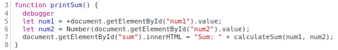

1. The bug was that `num1` and `num2` were of type `string` so `result` would
   be the concatenation of the two inputs.

2. I would fix it by converting `num1` and `num2` to a number using the unary
   operator `+` and the `Number()` function.

   
